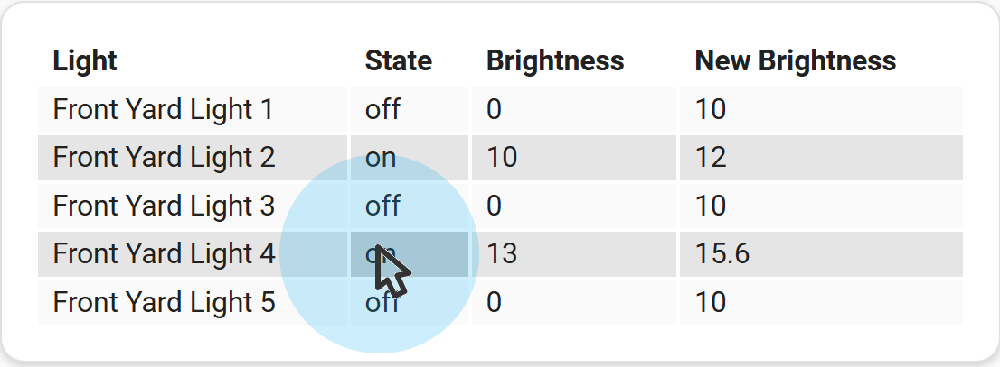
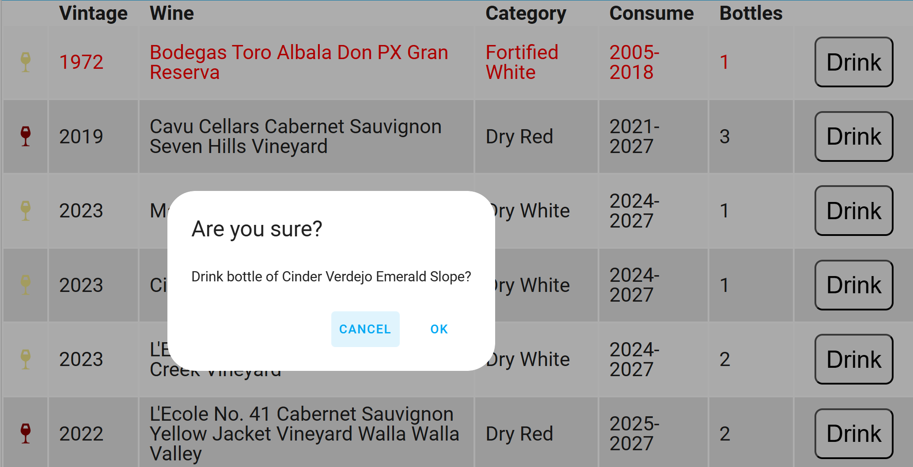
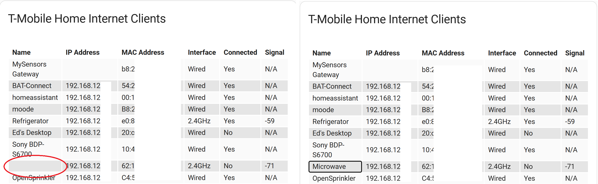
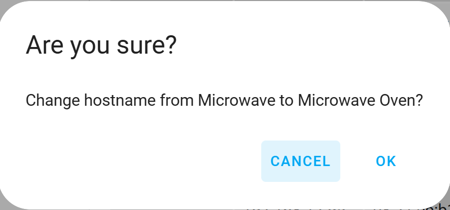

# Examples - Performing Actions

## Using Tap Actions

The `flex-table-card` supports the same tap actions as many other Home Assistant cards: `tap_action`, 
`hold_action`, and `double_tap_action`. The use of actions is described in the 
[Home Assistat Actions documentation](https://www.home-assistant.io/dashboards/actions/).

In addition, `flex-table-card` supports the `edit_action` which will be covered below.

When a column has been configured for actions, the cells of that column will be highlighted when a mouse hovers over them.

Note that the default size of cells may be too small to be accurately controlled with finger touches. You can use CSS
to increase the size of cells, as shown in some of the examples below.


### Example: Calling the `more-info` Action using `tap_action`

To perform the `more-info` Action when a cell in a configured column in `flex-table-card` is tapped, 
you can use a card definition such as the one below. Here, when a row in the Temperature column is tapped, 
a More Info popup will be displayed for the entity.

The entity does not need to be specified -- the row entity will automatically be used.

(Alternatively, you can set `clickable=true` on the entire card to perform the `more-info` Action on all columns of the card 
if you don't plan to use any other actions.)

``` yaml
type: custom:flex-table-card
entities:
  include:
    - sensor.*stairs*_temperature
auto_format: true
columns:
  - name: Name
    data: friendly_name
  - name: Temperature
    data: state
    tap_action:
      action: more-info
```

### Example: Calling the `toggle` Action using `double_tap_action`

The following definition shows how to toggle an entity using the `double_tap_action`. 
When a row in the State column is double-tapped, the entity's state will be toggled.

```yaml
type: custom:flex-table-card
entities:
  include:
    - light.bed*
columns:
  - name: Name
    data: friendly_name
  - name: State
    data: state
    double_tap_action:
      action: toggle
```
The entity does not need to be specified -- the row entity will automatically be used.
 

### Example: Calling the `perform-action` Action using `hold_action`

You can use a definition like the following to perform any supported Home Assistant action. This example demonstrates the
use of `hold_action`. When you press and hold your mouse or finger on a cell for more than half a second, 
you will see a visual cue when the action is ready to activate. Release to perform the action.

Move your mouse or finger off the cell before releasing to cancel the action.

This example demonstrates the use of `confirmation` to confirm the action. The `confirmation` option may be used on any action type.

Finally, the example uses the value in an adjacent cell to provide a parameter to the action. The reference to `cell[3]` uses
the value in the fourth column to specify a new brighness level for the light.

```yaml
type: custom:flex-table-card
entities:
  include: light.front_yard_light_*
sort_by: friendly_name
columns:
  - name: Light
    data: friendly_name
  - name: State
    data: state
    hold_action:
      action: perform-action
      confirmation:
        text: Increase Brightness?
      perform_action: light.turn_on
      data:
        brightness: cell[3]
        rgb_color:
          - 255
          - 0
          - 0
  - name: Brightness
    data: brightness
    modify: |
      typeof x === "number" ? x : 0
  - name: New Brightness
    data: brightness
    modify: |
      typeof x === "number" ? Math.min(parseInt(x * 1.2), 255) : 10
```

<br>__The hold_action provides feedback when activated.__


The target entity does not need to be specified -- the row entity will automatically be used.
However, if for some reason you need to provide an entity, you can specify an entity or entity list with the `target` option
on the action column. 

```yaml
      target:
        entity_id:
          - light.living_room_overheads
          - light.living_room_tall_lamp
          - light.fireplace_lamp
```
Note that entities specified with the `target` parameter would be used rather than the row entity for actions triggered 
from all rows in the table.


### Example: Calling the `navigate` Action using a col[n] reference to a hidden column

In this example, a user can click on an area and be taken to the view for that area. The example
assumes that there is a page for each area and that it is named the same as the area, with the 
exception of capitalization and spaces vs. dashes. The hidden column adjusts for these
differences, and the `navigation_path` contains a `col[n]` reference to it. (A `cell[n]`
reference cannot be used on a hidden column.)

```yaml
type: custom:flex-table-card
entities:
  include: light.*lamp
sort_by: friendly_name
columns:
  - name: Light
    data: friendly_name
  - name: State
    data: state
    tap_action:
      action: toggle
  - name: Area
    data: area
    tap_action:
      action: navigate
      navigation_path: /lovelace-tablet/col[3]
  - name: hiddenArea
    data: area
    hidden: true
    modify: x.toLowerCase().replace(" ","-")
```


### Example: Calling the `url` Action with a Button

The next example demonstrates a number of features of the `flex-table-card`. It uses the 
[Home Assistant Wine Cellar Integration](https://github.com/EdLeckert/wine-cellar) to demonstrate the use of
buttons to access an external website to complete an action. It shows some advanced techniques for formatting
columns as well as the use of `col[n]` to reference data in an adjacent hidden column.

```yaml
type: custom:flex-table-card
action: wine_cellar.get_distinct_inventory
entities:
  include: sensor.<member>_wine_inventory
sort_by:
  - ConsumeBy
  - Vintage
columns:
  - name: ""
    data: inventory
    align: center
    modify: |-
      function getColor(wineColor) {
        let color="red";
        switch(wineColor) {
            case "Red":
              color="DarkRed"
              break;
            case "White":
              color="Khaki"
              break;
            case "Rosé":
              color="LightPink"
              break;
            default:
              color="White";
              break;
        }
        return color;
      }  function getIcon(wineType) {
        let icon="mdi:glass-wine";
        switch(wineType) {
            case "Dry":
              icon="mdi:glass-wine"
              break;
            case "Sweet/Dessert":
              icon="mdi:glass-tulip"
              break;
            case "Sparkling":
              icon="mdi:glass-flute"
              break;
            default:
              icon="mdi:glass-wine"
              break;
        }
        return icon;
      } '<ha-icon icon=' + getIcon(x.Category) + ' style=color:' +
      getColor(x.Color) + ';></ha-icon>'
  - name: iWine
    data: inventory.iWine
    hidden: true
  - name: Vintage
    data: inventory.Vintage
    modify: if(parseInt(x) == 1001) {"N.V."} else{parseInt(x)}
  - name: Wine
    data: inventory.Wine
    double_tap_action:
      action: url
      url_path: https://www.cellartracker.com/list.asp?Table=List&szSearch=cell[2]
  - name: ConsumeBy
    data: inventory
    modify: |-
      (parseInt(x.BeginConsume) > new Date().getFullYear() ? "Z" : "") + 
      (((parseInt(x.BeginConsume) || 9999) +
       (parseInt(x.EndConsume) || 9999)) / 2)
    hidden: true
  - name: Category
    data: inventory
    modify: x.Category + " " + x.Color
  - name: Consume
    data: inventory
    modify: |-
      let result = 
        x.BeginConsume == "" && x.EndConsume == "" 
        ? "None"
        : x.BeginConsume + "-" + x.EndConsume;
        parseInt(x.BeginConsume) > new Date().getFullYear()
          ? '<div class="too-early">' + result + '</div>'
          : parseInt(x.EndConsume) < new Date().getFullYear()
            ?'<div class="too-late">' + result + '</div>'
            : result
  - name: Bottles
    data: inventory.Quantity
  - name: ""
    data: inventory.iWine
    modify: "\"<button class='button'>Drink</button>\""
    tap_action:
      action: url
      url_path: https://www.cellartracker.com/barcode.asp?iCart0=col[1]
      confirmation:
        text: |
          Drink bottle of cell[2]?
css:
  table: "font-size: 20px;"
  button: "font-size: 24px; border-radius: 8px; margin: 10px; padding: 10px"
  tr:has(> td div.too-early): color:darkslategray !important;
  tr:has(> td div.too-late): color:red !important;
```

When the user double-clicks on the Wine column, they are directed to a search page at `cellartracker.com`
using the text from the column for the search. When the user clicks on the `Drink` button and confirms the
action, they are taken to a page on the website where they can remove a bottle from their inventory. Both of
these actions open a new tab in the browser, so the browser must be configured to allow new tabs. Also, the 
user must be logged in to their account on `cellartracker.com` as no authentication credentials are passed.

<br>__This example demonstrates the use of advanced formatting, buttons to perform actions, and a confirmation dialog.__


## Using Edit Actions

### Example: Editing a cell using `edit_action`

The `edit_action` feature allows you to edit the text in a cell and then use any action to do whatever is necessary 
to save your changes. Typically you would use `perform-action` for this purpose.

The following example uses the 
[T-Mobile Home Internet Integration for Home Assistant](https://github.com/EdLeckert/ha-tmobilehome), which allows users
to control their T-Mobile Home Internet gateway from Home Assistant. The `flex-table-card` is an excellent way to view the list of
Wi-Fi and wired devices connected to the gateway. However, often the gateway is unable to retrieve the hostnames of certain devices,
so the integration provides an action to assign a meaningful name to the device for display in Home Assistant. The  `edit_action` 
feature provides the most user-friendly way to assign hostnames to devices.

When you use the `edit_action` option on a column, clicking in that column puts the cell in edit mode. To commit your change you can
press `Enter` or do anything to cause the cell to lose focus, such as tabbing or clicking outside of the cell. You can press the
`Esc` key to undo your unsaved changes. 

In this example, the `tmobile_home_internet.set_client_hostname` action is used to commit the user's edit back to the integration.
The parameters needed by this action, `mac_address` and the edited `hostname`, are provided by `cell[n]` references.

If a `target` entity is provided, it will override the row entity on all rows of the table. In this case, all rows share the same entity,
since it was provided for the `tmobile_home_internet.get_client_list` action that populates the card with data. So the `target` 
could have been omitted here.

```yaml
type: custom:flex-table-card
title: T-Mobile Home Internet Clients
action: tmobile_home_internet.get_client_list
entities:
  include: sensor.t_mobile_gateway
sort_by: IP Address
selectable: true
columns:
  - name: Name
    data: clients.name
    edit_action:
      action: perform-action
      perform_action: tmobile_home_internet.set_client_hostname
      target:
        entity_id: sensor.t_mobile_gateway
      data:
        mac_address: cell[2]
        hostname: cell[0]
  - name: IP Address
    data: clients.ipv4
  - name: MAC Address
    data: clients.mac
  - name: Interface
    data: clients.interface
  - name: Connected
    data: clients.connected
    modify: "x ? 'Yes' : 'No'"
  - name: Signal
    data: clients.signal
    modify: x || 'N/A'
```

<br>__The edit_action can be used to trigger any action.__


You can add a `confirmation` step to confirm any change before committing it. But be aware that the cell will retain 
the changed value even if you cancel the confirmation. You must re-edit the field or refresh the card, as appropriate.

The primary difference between a `cell[n]` reference and a `col[n]` reference is that the latter includes hidden columns.
But when editing a cell, it also contains the pre-edited value. So the following confirmation definition could be used to 
display before and after values, but beware. If the source of the card's data is a script, the card will need to be refreshed 
after the edit, or the `col[n]` reference will continue to show the original data on subsequent edits.

```yaml
      confirmation:
        text: Change hostname from col[0] to cell[0]?
```

<br>__Cell refrerences can be used to add </br>meaningful information to </br>confirmation dialogs.__


[Return to main README.md](../README.md)
