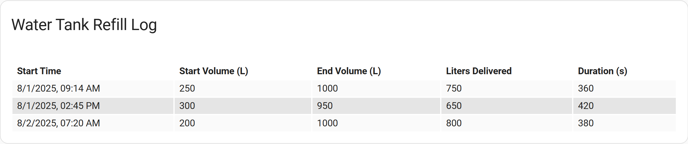

# Examples - Loading from Files

## CSV Files
<!-- [full text section] -->
### Demonstration of using the Command line integration to load a CSV file into the flex-table-card

While the `flex-table-card` cannot natively load data from a file, as is often the case, an entity can be
created which can be used as an intermediate step to populate the card. In this case, we will use the
`Command line` integration to create a `sensor` entity to load a CSV file. 

Consider the following CSV file, which contains readings from a watertank system:

```
Start Time,Start Volume (L),End Volume (L),Liters Delivered,Duration (s)
2025-08-01T09:14:00,250,1000,750,360
2025-08-01T14:45:00,300,950,650,420
2025-08-02T07:20:00,200,1000,800,380
```
We would like to display this data in a `flex-table-card`:



The configuration for the `sensor` entity in configuration.yaml is as follows:

``` yaml
command_line:
  - sensor:
      name: Water Tank Refill Logs
      command: >
        curl -s http://<HA IP Addr>:8123/local/WaterTank.csv | jq --slurp --raw-input --raw-output '{refill_logs: split("\r\n") | .[1:] | map(split(",")) | map({"startTime": .[0],"startVolume": .[1],"endVolume": .[2],"litersDelivered": .[3],"duration": .[4]})}'
      json_attributes:
        - refill_logs
      scan_interval: 3600
```

Note that we are using the `[jq language](https://jqlang.org/)` to parse the CSV data into a JSON format 
that the `flex-table-card` can understand. The `curl` command fetches the CSV file from the `config/www` 
folder on the Home Assistant server, and `jq` processes it to create a JSON object with an array of refill logs.

There are several important things to note about the `jq` syntax used here.

1. The `split("\r\n")` function splits the CSV data into an array of lines. You may need to adjust this if your CSV uses a different line ending (e.g., `\n` for Unix-style line endings).
2. The `[1:]` filter skips the header line. Remove this filter if the file does not have a header.
3. The headings "startTime", "startVolume", "endVolume", "litersDelivered", and "duration" are used to create the keys in the JSON object. You will need to adjust these to match the headings in your CSV file.
4. The string `refill_logs` will be the name of the attribute of the sensor. You should change it in both places in the example.

Restart Home Assistant to apply the changes. After that, you should see a new sensor entity called `sensor.water_tank_refill_logs`.

An example card definition follows:

```yaml
type: custom:flex-table-card
title: Water Tank Refill Log
entities:
  include: sensor.water_tank_refill_logs
columns:
  - name: Start Time
    data: refill_logs.startTime
    modify: >
      new Date(x).toLocaleDateString(undefined, { year: 'numeric', month:
      'numeric', day: 'numeric', hour: '2-digit', minute: '2-digit' })
  - name: Start Volume (L)
    data: refill_logs.startVolume
  - name: End Volume (L)
    data: refill_logs.endVolume
  - name: Liters Delivered
    data: refill_logs.litersDelivered
  - name: Duration (s)
    data: refill_logs.duration
```

The date has been modified to be more human-readable.

[Return to main README.md](../README.md)
