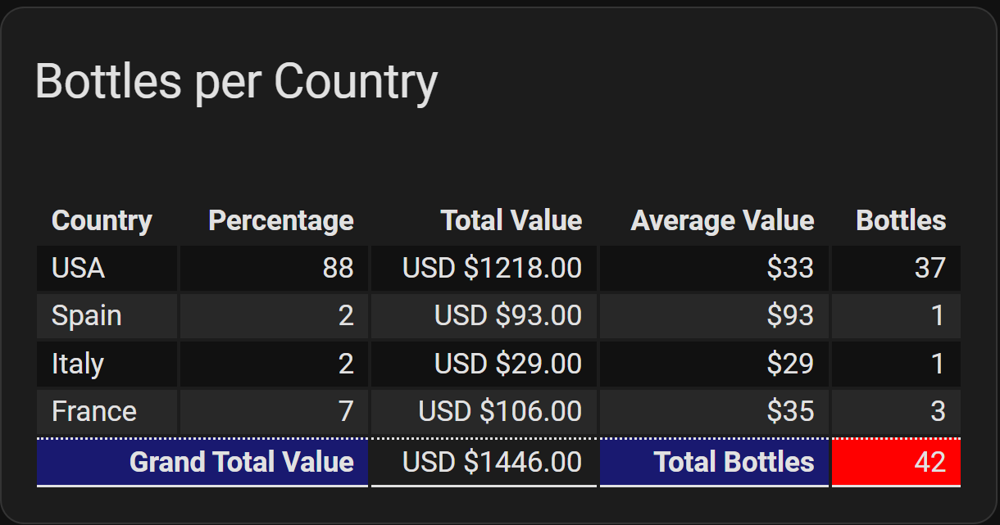

# Examples - Summary Footer

## Adding a summary footer row to a table
<!-- [full text section] -->

To display a summary footer row below the data rows of a table, add this line to the `custom:flex-table-card` config:

<!-- [listing section] -->
``` yaml
display_footer: true
```

Next, use `footer_type` to identify the columns which will display summary information. A column can be summarized using any of the following values for `footer_type`:

* sum (total of numbers in column)
* average (average of numbers in column)
* count (count of rows)
* max (largest number in column)
* min (smallest number in column)
* header (text)

For example, to show totals for a column of numbers:

``` yaml
  - name: Value
    data: value
    footer_type: sum
```

### Cells included in summary

Only cells with values that can be interpreted as numbers will be included in the summary when using `sum`, `average`, `max`, or `min`. 
The number can have leading and trailing spaces, and any number of trailing non-numeric characters, but only the column `prefix` plus _one_ leading non-numberic character, 
such as a currency sign. Otherwise it will be ignored.

### Formatting values

The formatting options `align`, `prefix`, and `suffix` (but not `modify`) will also apply to the summary row.
Use `footer_modify` to apply any special formatting to any `footer_type` except `header`. As summary values are not associated with a single entity or entity attribute, 
`auto_format` cannot be used to format them.

### Using CSS

The default formatting of the row displays a solid line above and below the row:

``` yaml
"tfoot *": "border-style: solid none solid none;"
```

This can be overridden using the `css` option in the config. Available CSS selectors under `tfoot` are `tr`, `th`, and `td`. Also available are `ID` selectors of the form `'#tfootcol<n>'`,
where `<n>` is the column number, beginning with 0. Only non-hidden columns are counted.

### Displaying text

To display text in one or more columns, use `footer_type: header` and `footer_text: <the text>`. Use `footer_colspan` to span more than one column. For example:

``` yaml
  - name: Country
    data: countries
    footer_type: header
    footer_text: Total Value
    footer_colspan: 2
```

Note that the text "Total Value" has no conceptual relationship to the column containing a list of countries in this example. This is simply the first of two columns where
the text will be displayed, with the expectation that the following column will contain a sum of values.

### Complete example

The following example demonstrates the use of each of the above options.

``` yaml
type: custom:flex-table-card
title: Bottles per Country
service: wine_cellar.get_countries
entities:
  include: sensor.member_wine_inventory
sort_by: Country-
display_footer: true
columns:
  - name: Country
    data: countries
    modify: x.Country
    footer_type: header
    footer_text: Grand Total Value
    footer_colspan: 2
  - name: Percentage
    data: countries
    modify: x.percent
    align: right
  - name: Total Value
    data: countries
    modify: ('$' + x.value_total + '.00')
    align: right
    prefix: 'USD '
    footer_type: sum
    footer_modify: ('$' + x + '.00')
  - name: Average Value
    data: countries
    modify: x.value_avg
    align: right
    prefix: $
    footer_type: header
    footer_text: Total Bottles
  - name: Bottles
    data: countries
    modify: x.count
    align: right
    footer_type: sum
css:
  tfoot th: 'text-align: right;background-color: midnightblue;'
  '#tfootcol4': 'background-color: red'
  tfoot *: 'border-style: dotted none solid none;'

```

<!-- [example image section] -->



[Return to main README.md](../README.md)
