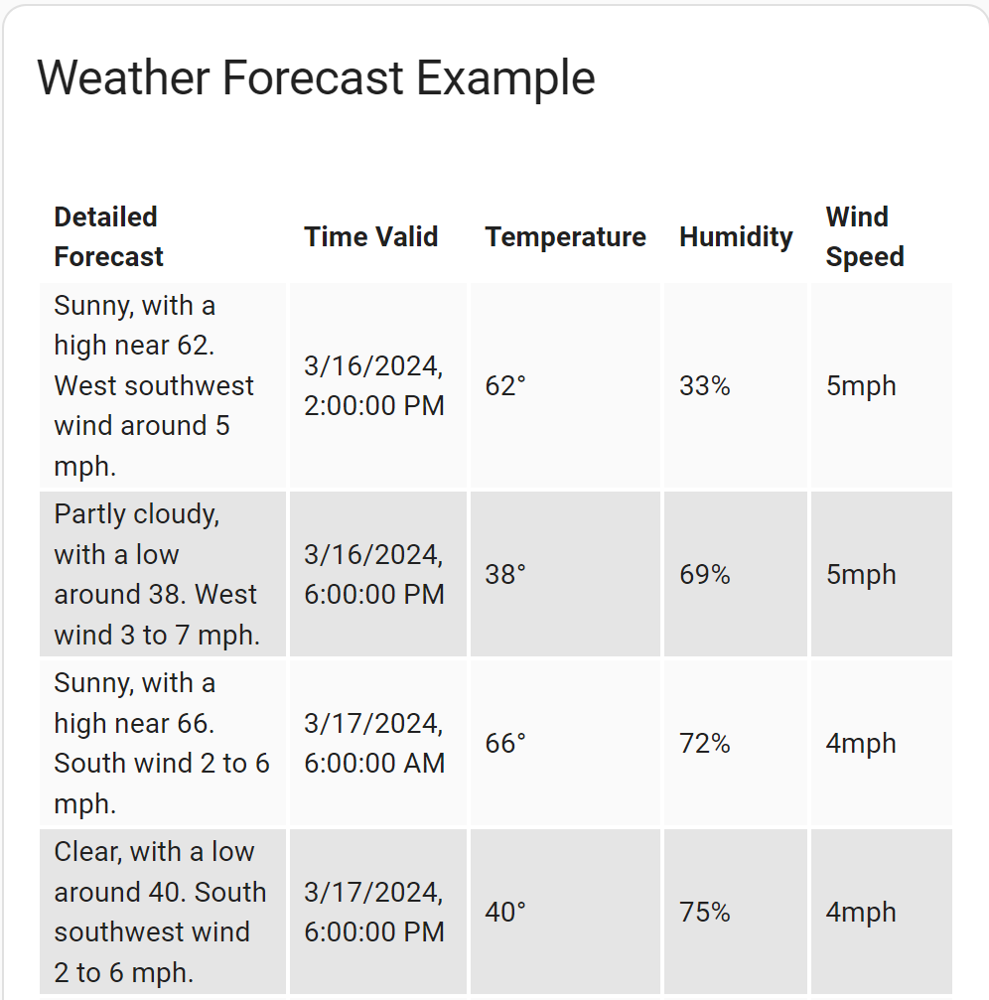
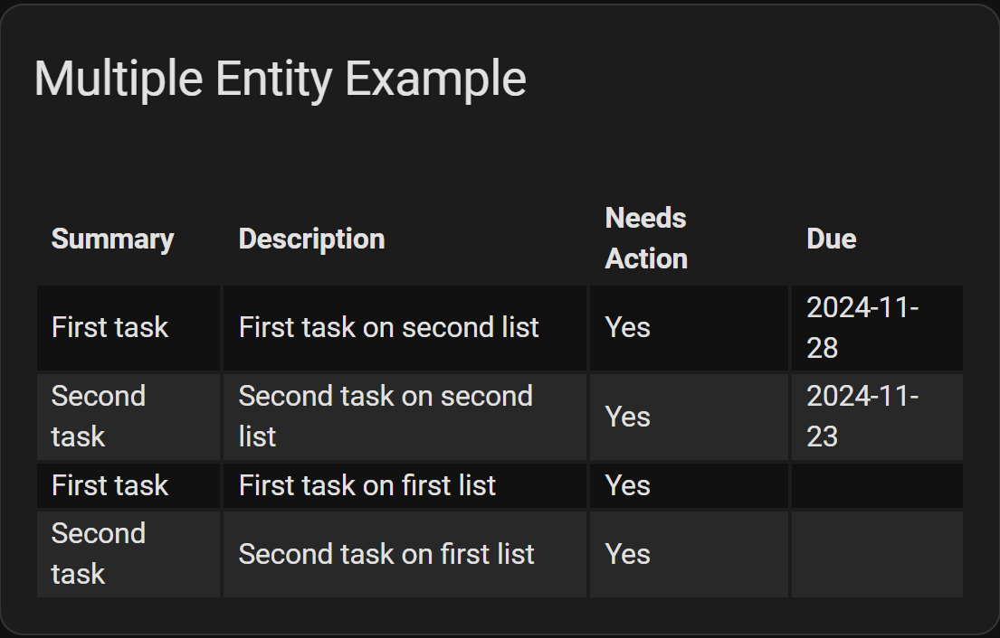
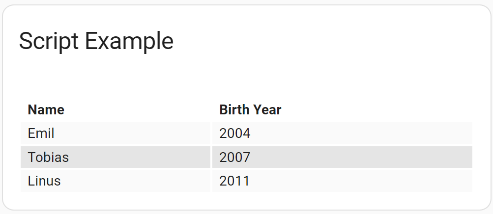

# Examples - Actions

## Convert from attributes to action
<!-- [full text section] -->
### Demonstration of converting a flex-table-card from using `weather` entity attributes to using an action call response

Home Assistant is moving away from large entity attribute structures in favor of using `action` (formerly `service`) call responses. As a result, you may find yourself needing to convert from using
attributes to using action calls to populate your `flex-table-card`. Fortunately, the process is usually very simple. Consider this card definition that gets the weather
forecast from a `weather` entity's attributes.

<!-- [listing section] -->
``` yaml
type: custom:flex-table-card
title: Weather Forecast Example
entities:
  - weather.kboi_daynight
columns:
  - name: Time Valid
    data: forecast.datetime
    modify: new Date(x).toLocaleString()
  - name: Temperature
    data: forecast.temperature
    suffix: °
  - name: Precipitation
    data: forecast.precipitation_probability
    suffix: "%"
  - name: Wind Speed
    data: forecast.wind_speed
    modify: x.toFixed(0)
    suffix: " mph"
```

To convert from using a `weather` entity's attributes to using the `get_forecasts` action call, simply add these lines (adjust `type` as needed):

``` yaml
action: weather.get_forecasts
action_data:
    type: twice_daily
```

This will work if the `get_forecasts` action returns information in the same format as the `weather` entity's attributes did. Adjustments must be made if this is not the case.

<!-- [example image section] -->


## Using multiple entities
<!-- [full text section] -->
### Example configuration to populate flex-table-card with action call response from multiple `todo` entities

<!-- [listing section] -->
``` yaml
type: custom:flex-table-card
title: Multiple Entity Example
action: todo.get_items
entities:
  - todo.first_list
  - todo.second_list
columns:
  - name: Summary
   data: items.summary
  - name: Description
    data: items.description
    modify: x || ""
  - name: Needs Action
    data: items
    modify: if (x.status == "needs_action") {"Yes"} else {"No"}
  - name: Due
    data: items.due
    modify: x || ""
```

<!-- [example image section] -->


## Using a script as the source
<!-- [full text section] -->
### Example configuration to populate flex-table-card with action call response from a script

Note that `entities`, while not needed for the action, still must be present:

<!-- [listing section] -->
``` yaml
type: custom:flex-table-card
title: Script Example
action: script.test_response
entities: []
columns:
  - name: Name
    data: family.name
  - name: Birth Year
    data: family.year
```
This is the script:

``` yaml
test_response:
  alias: Test Response
  variables:
    family: >
        
        {{ myfamily }}
  sequence:
    - stop: All Done
      response_variable: family
```

<!-- [example image section] -->


[Return to main README.md](../README.md)
