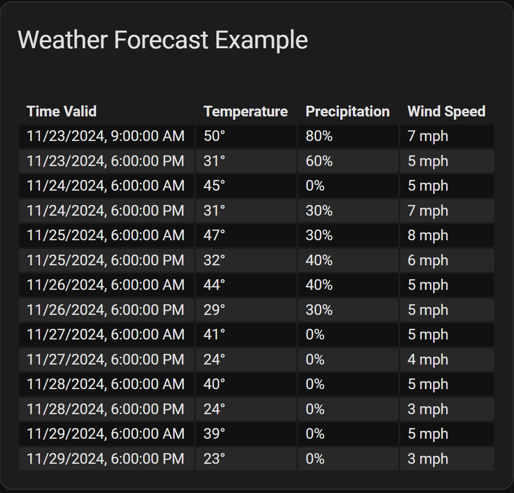

# Examples - Loading from Actions and Scripts

## Convert from attributes to action
<!-- [full text section] -->
### Demonstration of converting a flex-table-card from using `weather` entity attributes to using an action call response

Home Assistant is moving away from large entity attribute structures in favor of using `action` (formerly `service`) call responses. As a result, you may find yourself needing to convert from using
attributes to using action calls to populate your `flex-table-card`. Fortunately, the process is usually very simple. Consider this card definition that gets the weather
forecast from a `weather` entity's attributes.

<!-- [listing section] -->
``` yaml
type: custom:flex-table-card
title: Weather Forecast Example
entities:
  - weather.kboi_daynight
columns:
  - name: Time Valid
    data: forecast.datetime
    modify: new Date(x).toLocaleString()
  - name: Temperature
    data: forecast.temperature
    suffix: °
  - name: Precipitation
    data: forecast.precipitation_probability
    suffix: "%"
  - name: Wind Speed
    data: forecast.wind_speed
    modify: x.toFixed(0)
    suffix: " mph"
```

To convert from using a `weather` entity's attributes to using the `get_forecasts` action call, simply add these lines (adjust `type` as needed):

``` yaml
action: weather.get_forecasts
action_data:
    type: twice_daily
```

This will work if the `get_forecasts` action returns information in the same format as the `weather` entity's attributes did. Adjustments must be made if this is not the case.

<!-- [example image section] -->


## Using multiple entities
<!-- [full text section] -->
### Example configuration to populate flex-table-card with action call response from multiple `todo` entities

<!-- [listing section] -->
``` yaml
type: custom:flex-table-card
title: Multiple Entity Example
action: todo.get_items
entities:
  - todo.first_list
  - todo.second_list
columns:
  - name: Summary
   data: items.summary
  - name: Description
    data: items.description
    modify: x || ""
  - name: Needs Action
    data: items
    modify: if (x.status == "needs_action") {"Yes"} else {"No"}
  - name: Due
    data: items.due
    modify: x || ""
```

<!-- [example image section] -->


## Using a script as the source
<!-- [full text section] -->
### Example configuration to populate flex-table-card with action call response from a script

Note that `entities`, while not needed for the action, still must be present:

<!-- [listing section] -->
``` yaml
type: custom:flex-table-card
title: Script Example
action: script.test_response
entities: []
columns:
  - name: Name
    data: family.name
  - name: Birth Year
    data: family.year
```
This is the script:

``` yaml
test_response:
  alias: Test Response
  variables:
    family: >
        
        {{ myfamily }}
  sequence:
    - stop: All Done
      response_variable: family
```

<!-- [example image section] -->


### Example configuration to select an array element from a list

In this example we will use dot notation to select only the information needed, in this case, the second element from the `inventory` array.

``` yaml
type: custom:flex-table-card
title: 2025 Outback
entities: []
action: script.select_element
columns:
  - name: Color
    data: inventory.1.color
  - name: Configuration
    data: inventory.1.configuration
  - name: MSRP
    data: inventory.1.MSRP
```

This is the script used to supply the data:

``` yaml
select_element:
  alias: Select Element
  variables:
    cars: >
        {% set available_cars = { "inventory": [
          {
            "name" : "Forester",
            "year" : 2024,
            "color" : ["blue", "red", "black"],
            "configuration" : ["Base", "Premium", "Touring"],
            "MSRP" : ["$32,557", "$34,288", "$42,707"]
          },
          {
            "name" : "Outback",
            "year" : 2025,
            "color" : ["white", "gray", "maroon"],
            "configuration" : ["Premium", "Limited", "Touring"],
            "MSRP" : ["$36,482", "$40,299", "$42,789"]
          },
          {
            "name" : "Impreza",
            "year" : 2024,
            "color" : ["orange", "red", "yellow"],
            "configuration" : ["Base", "Premium", "Touring"],
            "MSRP" : ["$32,557", "$34,288", "$42,707"]
          }
        ] }
        %}
        {{ available_cars }}
  sequence:
    - stop: All Done
      response_variable: cars
```


This technique can be used multiple times in the same `data` statement if there are multiple arrays in the path.

### Refreshing table contents populated by Actions

Home Assistant does not automatically know when the response of an action might change.
Therefore, it is not possible to have a `flex-table-card` automatically refresh when this happens.
However, if an entity is specified in the card definition, the card will refresh whenever the state
or attributes of the entity changes, and that may be a good solution.

Consider this example to display the hourly weather forecast from the National Weather Service in Boise, Idaho:

``` yaml
type: custom:flex-table-card
title: Weather Forecast Example
action: weather.get_forecasts
action_data:
  type: hourly
entities:
  - weather.kboi_daynight
columns:
  - name: Time Valid
    data: forecast.datetime
    modify: new Date(x).toLocaleString()
  - name: Temperature
    data: forecast.temperature
    suffix: °
  - name: Precipitation
    data: forecast.precipitation_probability
    suffix: "%"
  - name: Wind Speed
    data: forecast.wind_speed
    modify: x.toFixed(0)
    suffix: " mph"
```

The `weather.get_forecasts` Action requires an entity, in this case `weather.kboi_daynight`. Whenever the
state or attributes of this entity (which tracks current conditions, not the forecast) changes, the table
will automatically update the forecast.

### Refreshing table contents populated by custom Scripts

Tables populated by scripts can be automatically updated as well by including entities in the card definition.
However, a change to the script is required to make this work properly.

When an Action that returns a response is called, it usually requires that an entity be specified. In the
response, the first level of JSON returned will be that entity. Consider this call to return the contents of
two `todo` lists, which can be run in the `Actions` tab of `Developer tools` with your own `todo` entities:

``` yaml
action: todo.get_items
target:
  entity_id:
    - todo.first_list
    - todo.second_list
```

The returned response data is structured like this (some values removed for brevity):

``` yaml
todo.first_list:
  items:
    - summary: First task
      description: First task on first list
    - summary: Second task
      description: Second task on first list
todo.second_list:
  items:
    - summary: First task
      description: First task on second list
    - summary: Second task
      description: Second task on second list
```

Notice the top level keys, the entities to which the data belongs.

**IMPORTANT:** When using a custom script to return data to a `flex-table-card`:
* If one or more entities are specified in the definition, the top level key of the returned
JSON for each entity MUST be the entity_id.
* If entities are NOT specified (`entities: []`), the top level MUST be the key of the list of rows,
such as `items` in the above example (`items` would only occur once in this case).

The entity returned in the response does not need to be the same as the one(s) in the card definition. In fact,
it doesn't even have to be a valid entity...what is important is its position in the JSON. However, this
string will be used as the entity_id for any operations on the row, such as when `clickable: true` is set
to show the `more-info` dialog, so it makes sense to return the correct entity_id.

Here is a contrived example that shows how you can even specify the entity for the script to use in the
card definition:

``` yaml
type: custom:flex-table-card
clickable: true
action: script.test_script_refresh
entities:
  - light.office_overheads
columns:
  - name: Light
    data: records.friendly_name
  - name: State
    data: records.state
```

The script would then be:

``` yaml
test_script_refresh:
  variables:
    values: >
      
      {{ response }}
  sequence:
    - stop: All Done
      response_variable: values
```

This script supports the use of entities in the card definition by supplying an additional level to the
JSON hierarchy, with `entity_id[0]` as the key to this new top level. (`entity_id` returns an array of
entities specified in the card. However, this simple example only works for a single entity.)

When the state of the light entity changes, the script is refreshed. Clicking on the row invokes the
more-info dialog for the entity, or you could use tap-actions to call an action using the entity.

[Return to main README.md](../README.md)
