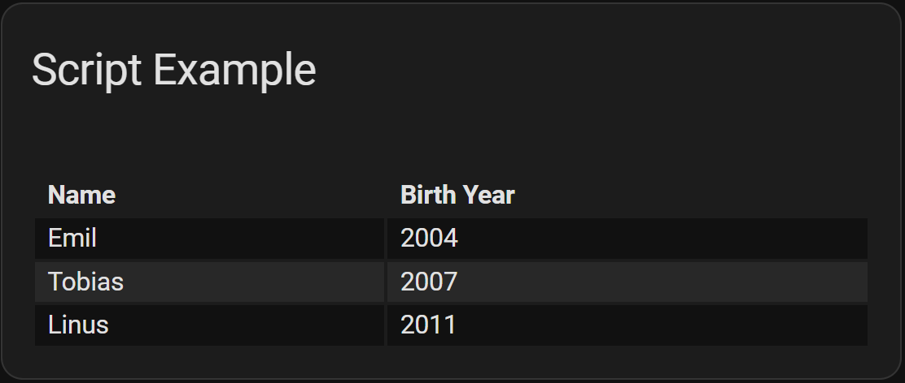

# Examples - Services

## Convert from attributes to service
<!-- [full text section] -->
### Demonstration of converting a flex-table-card from using `weather` entity attributes to using a service call response

<!-- [listing section] -->
``` yaml
type: custom:flex-table-card
title: Weather Forecast Example
entities:
  - weather.kboi_daynight
columns:
  - name: Detailed Forecast
    data: forecast
    modify: x.detailed_description
  - name: Time Valid
    data: forecast
    modify: new Date(x.datetime).toLocaleString()
  - name: Temperature
    data: forecast
    modify: x.temperature
    suffix: °
  - name: Humidity
    data: forecast
    modify: x.humidity
    suffix: '%'
  - name: Wind Speed
    data: forecast
    modify: x.wind_speed
    suffix: mph
```

To convert from using a `weather` entity's attributes to using the `get_forecasts` service call, simply add these lines (adjust `type` as needed):

``` yaml
service: weather.get_forecasts
service_data:
    type: twice_daily
```

This works because the `get_forecasts` service returns information in the same format as the `weather` entity's attributes did. This simple technique may not work with other integrations.

Whether using attributes or the service call, the result is exactly the same:
<!-- [example image section] -->


## Using multiple entities
<!-- [full text section] -->
### Example configuration to populate flex-table-card with service call response from multiple `todo` entities

<!-- [listing section] -->
``` yaml
type: custom:flex-table-card
title: Multiple Entity Example
service: todo.get_items
entities:
  - todo.first_list
  - todo.second_list
columns:
  - name: Summary
    data: items
    modify: x.summary
  - name: Description
    data: items
    modify: x.description || ""
  - name: Needs Action
    data: items
    modify: if (x.status == "needs_action") {"Yes"} else {"No"}
  - name: Due
    data: items
    modify: x.due || ""
```

<!-- [example image section] -->


## Using a script as the source
<!-- [full text section] -->
### Example configuration to populate flex-table-card with service call response from a script

Note that `entities`, while not needed for the service, still must be present:

<!-- [listing section] -->
``` yaml
type: custom:flex-table-card
title: Script Example
service: script.test_response
entities: []
columns:
  - name: Name
    data: family
    modify: x.name
  - name: Birth Year
    data: family
    modify: x.year
```
This is the script:

``` yaml
test_response:
  alias: Test Response
  variables:
    family: >
        
        {{ myfamily }}
  sequence:
    - stop: All Done
      response_variable: family
```

<!-- [example image section] -->


[Return to main README.md](../README.md)
