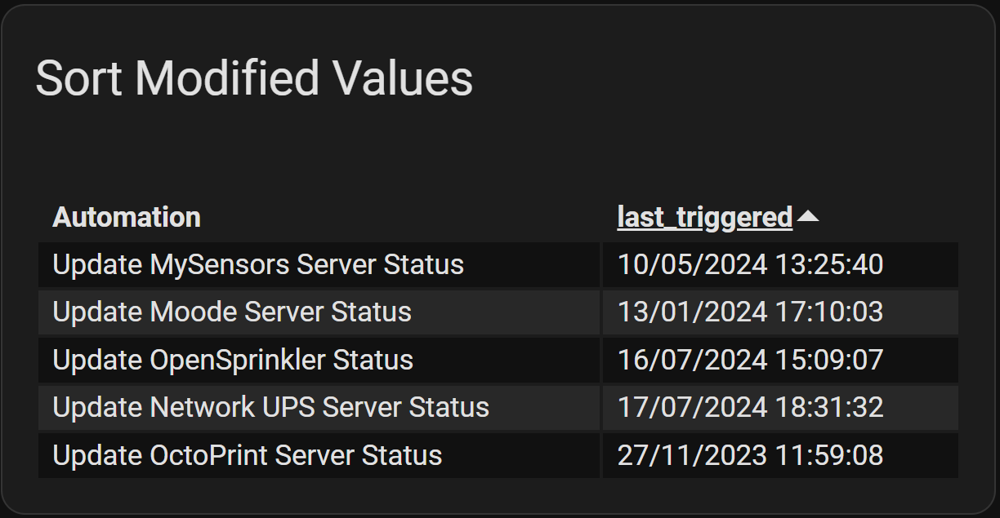
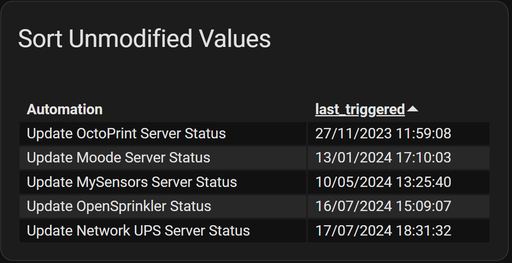

## Examples - Sorting and *Strict* Row Visibility

An extremly useful `flex-table-card` config: <br/>**List and sort all battery
powered devices** by their battery level, so the next batteries to be
replaced are visible within the first row(s):

``` yaml
type: 'custom:flex-table-card'

# use the column's attr(ibute) as reference for the column to be sorted
# the '+' explicitly sets ascending order, '-' sets descending order 
sort_by: battery_level+

# ensure that only rows are diplayed, which do have matched and valid contents
# within all(!) columns, means if the attr(ibute) 'battery_level' does not 
# exist within an entity, the entity and thus the row will not be displayed.
strict: true
title: Battery Levels

entities:
  # both 'include' and 'exclude' can either been set to a single (regex) string
  # or to a list-of (regex) strings
  exclude:
    - unknown_device
  include: zwave.*

columns:
  - name: NodeID
    data: node_id
  - name: Name
    data: name
  - name: Reported Battery Level (%)
    data: battery_level
```

Furthermore it is possible to use `sort_by` with multiple columns, by passing a list of columns 
like this:

```
sort_by: [battery+, name-]
```
alternatively using the line-wise list notation:
```
sort_by:
  - battery+
  - name-
```

## Sorting and the Modify Option

By default, if a column uses the `modify` option, the column will be sorted using the result _after_ the modify operation is applied. This normally produces the desired result. 

In some cases, it is absoutely necessary to use the modified values. For example, in cases where `data` contains a complex structure and `modify` is used to select 
a subset of that data, the sort operation _must_ use the modified value in order to get a meaningful result. Otherwise, the entire `data` value would be used for the sort.

**Note: In releases after v0.7.7, using `modify` as a data selector is discouraged. The `data` option can now be used to walk complex structures where `modify` was once needed.**

There are cases where the `modify` operation results in values that do not sort correctly. For example, if the modification is used to dynamically create prefixes or suffixes 
such as HTML tags, the entire string including the HTML tags will be used for the sort operation.

Another example is a date formatted in the locale of the user. If a date such as "2024-06-23", which sorts correctly, is converted using `modify` to "6/23/2024" or "23/06/2024",
it will no longer sort as desired.

Therefore, to sort using the original value before the `modify` option was applied, use the `sort_unmodified: true` option in the column configuration.

Here is an example of the date formatting issue:

``` yaml
type: custom:flex-table-card
title: Sort Modified Values
entities:
  include: automation.update*
sort_by: last_triggered
columns:
  - name: Automation
    data: name
  - name: last_triggered
    data: last_triggered
    modify: |-
      if (x) {
        if(x.length == 0){
          "-"
        }
        else {
            var date = new Date(x);

            (String(date.getDate()).padStart(2,'0')) +
            "/" +
            (String(date.getMonth()+ 1).padStart(2,'0')) + 
            "/" +
            date.getFullYear() +
            " " +
            String(date.getHours()).padStart(2,'0') +
            ":" +
            String(date.getMinutes()).padStart(2,'0') +
            ":" +
            String(date.getSeconds()).padStart(2,'0')
        }
      } else {
        "-"
      }
```

The rows are clearly not sorted in date order:



Adding this line to the column configuration...

``` yaml
    sort_unmodified: true
```

...fixes the issue:



[Return to main README.md](../README.md)
