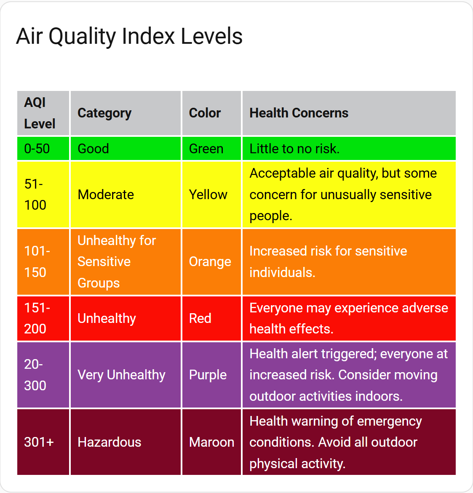

# Examples - Displaying Static Data

## Defining Static Data within the Card Configuration

### Example using Air Quality Index Levels

To display data that does not come from Home Assistant entities or actions, you can define static data
directly within the card configuration by using the `static_data` tag. This is useful for reference tables
or any other information that doesn't change frequently.

Consider the following example, which displays the Air Quality Index (AQI) levels along with their
descriptions and health implications:

``` yaml
type: custom:flex-table-card
title: Air Quality Index Levels
entities: []
columns:
  - name: AQI Level
    data: aqi.level
  - name: Category
    data: aqi.category
  - name: Color
    data: aqi.color
  - name: Health Concerns
    data: aqi.concerns
static_data:
  aqi:
    - level: 0-50
      category: Good
      color: Green
      concerns: Little to no risk.
    - level: 51-100
      category: Moderate
      color: Yellow
      concerns: Acceptable air quality, but some concern for unusually sensitive people.
    - level: 101-150
      category: Unhealthy for Sensitive Groups
      color: Orange
      concerns: Increased risk for sensitive individuals.
    - level: 151-200
      category: Unhealthy
      color: Red
      concerns: Everyone may experience adverse health effects.
    - level: 20-300
      category: Very Unhealthy
      color: Purple
      concerns: >-
        Health alert triggered; everyone at increased risk. Consider moving
        outdoor activities indoors.
    - level: 301+
      category: Hazardous
      color: Maroon
      concerns: >-
        Health warning of emergency conditions. Avoid all outdoor physical
        activity.
css:
  thead: "background-color: rgb(199,200,202);"
  tbody tr:nth-child(1)+: "color: black; background-color: rgb(0,226,10);"
  tbody tr:nth-child(2)+: "color: black; background-color: rgb(252,255,18);"
  tbody tr:nth-child(3)+: "color: white; background-color: rgb(251,126,6);"
  tbody tr:nth-child(4)+: "color: white; background-color: rgb(251,13,4);"
  tbody tr:nth-child(5)+: "color: white; background-color: rgb(137,64,152);"
  tbody tr:nth-child(6)+: "color: white; background-color: rgb(124,6,37);"
```

Entities and actions cannot be used in conjunction with `static_data`. The `entities` field is required but
is set to an empty array in this example to indicate that no entities are being used.

Columns are defined as usual, with the `data` field pointing to the relevant keys in the `static_data` section.

Note that a top-level key (in this case, `aqi`) is used to group the array of static data entries. 
This key is then referenced in the data fields of the columns. This structure is required in order to mimic
the structure normally returned by entities or actions.

The `css` section is used to style the table, including setting background colors for each AQI level.

The resulting table will look like this:



[Return to main README.md](../README.md)
